# Liste des commandes en `mlog`

Dans cette section, nous allons explorer les différentes commandes disponibles en `mlog` pour la création de circuits
logiques et de systèmes de contrôle sophistiqués dans *Mindustry*. Ces commandes sont essentielles pour automatiser les
processus de production, optimiser les ressources et améliorer les performances de tes installations.

On trouve dans `mlog` plusieurs types de commandes, chacune ayant une fonction spécifique. Voici une liste des commandes
disponibles en `mlog` :

- `Entrée & Sortie`
- `Contrôle de Blocs`
- `Opérations`
- `Contrôle de Flux`
- `Contrôle d'unités`

---

## Entrée & Sortie

Les commandes d'entrée et de sortie permettent de récupérer des données ou transmettre des données.

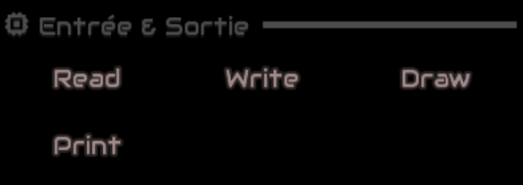

Les commandes d'entrée et de sortie `simple` disponibles en `mlog` sont les suivantes :

- `read` : permet de lire une variable depuis une cellule mémoire.
- `write` : permet d'écrire une variable dans une cellule mémoire.
- `print` : permet d'afficher un message texte dans un bloc de message.
- `draw` : permet de dessiner sur un écran.

### `read`


```mlog
read <variable> <cellule mémoire> <emplacements>
```

- `<variable>` : nom de la variable à lire dans la cellule mémoire.
- `<cellule mémoire>` : nom du bâtiment de stockage de la variable. (généralement une cellule mémoire)
- `<emplacements>` : Entier qui indique l'emplacement de la variable à lire.

### `write`

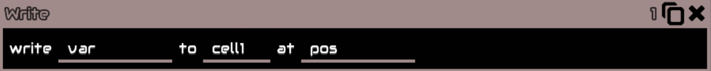

```mlog
write <variable> <cellule mémoire> <emplacements>
```

- `<variable>` : nom de la variable à écrire dans la cellule mémoire. (peut aussi être le contenu d'une
  variable directement)
- `<cellule mémoire>` : nom du bâtiment de stockage de la variable. (généralement une cellule mémoire)
- `<emplacements>` : Entier qui indique l'emplacement pour la sauvegarde de la variable.

### `print`

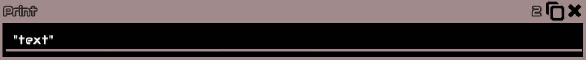

```mlog
print <message>
```

- `<message>` : message texte à afficher dans le bloc de message.
- **Remarque** : il faut utiliser des guillemets pour les messages textes sinon le code l'intégrera comme une variable.
- **⚠ Attention** : le message n'est pas affiché dans un bloc de message si la commande `Print Flush` n'est pas
  utilisé. (voir [Contrôle de Flux](#contrôle-de-flux))

### `draw`

```mlog
draw <type de dessin> <paramètres liés au type de dessin>
```

- `<type de dessin>` : type de dessin à afficher sur l'écran.
- `<paramètres liés au type de dessin>` : paramètres spécifiques au type de dessin.

Les types de dessin disponibles en `mlog` sont les suivants :

- `clear` : efface l'écran par une couleur de fond.
- `color` : définit la couleur du dessin.
- `col` : équivalent à `color` mais valable que pour une colonne.
- `stroke` : définit l'épaisseur du trait.
- `line` : dessine une ligne.
- `rect` : dessine un rectangle.
- `lineRect` : dessine un rectangle avec des lignes.
- `poly` : dessine un polygone.
- `linePoly` : dessine un polygone avec des lignes.
- `triangle` : dessine un triangle.
- `image` : affiche une image.

1. `clear` : efface l'écran.

   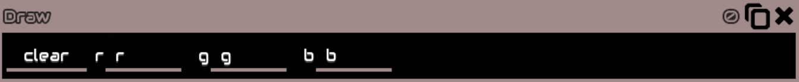

    ```mlog
    draw clear r g b 0 0
    ```

    - `r` : valeur de la composante rouge de la couleur de fond. (0-255)
    - `g` : valeur de la composante verte de la couleur de fond. (0-255)
    - `b` : valeur de la composante bleue de la couleur de fond. (0-255)
    - `0 0` : paramètres inutilisés.

2. `color` : définit la couleur du dessin.

   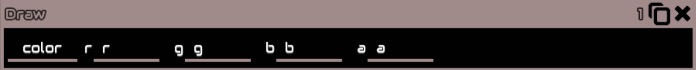

    ```mlog
    draw color r g b a 0 0
    ```

    - `r` : valeur de la composante rouge de la couleur. (0-255)
    - `g` : valeur de la composante verte de la couleur. (0-255)
    - `b` : valeur de la composante bleue de la couleur. (0-255)
    - `a` : valeur de la composante alpha de la couleur. (0-255)
    - `0 0` : paramètres inutilisés.

3. `col` : équivalent à `color` mais valable que pour une colonne.

   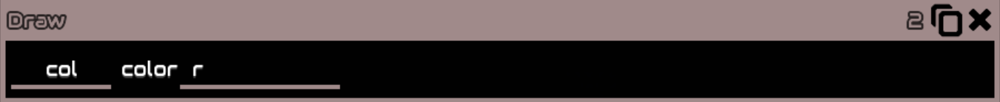

    ```mlog
    draw col r g b a 0 0
    ```

    - `r` : valeur de la composante rouge de la couleur. (0-255)
    - `g` : valeur de la composante verte de la couleur. (0-255)
    - `b` : valeur de la composante bleue de la couleur. (0-255)
    - `a` : valeur de la composante alpha de la couleur. (0-255)
    - `0 0` : paramètres inutilisés.

4. `stroke` : définit l'épaisseur du trait.

   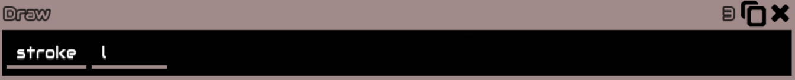

    ```mlog
    draw stroke l 0 0 0 0 0
    ```

    - `l` : épaisseur du trait. (0-255)
    - `0 0 0 0 0` : paramètres inutilisés.

5. `line` : dessine une ligne.

   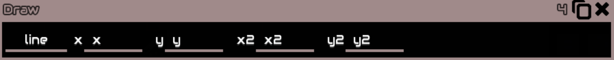

    ```mlog
    draw line x y x2 y2 0 0
    ```

    - `x` : coordonnée x du point de départ de la ligne.
    - `y` : coordonnée y du point de départ de la ligne.
    - `x2` : coordonnée x du point d'arrivée de la ligne.
    - `y2` : coordonnée y du point d'arrivée de la ligne.
    - `0 0` : paramètres inutilisés.

6. `rect` : dessine un rectangle plein.

   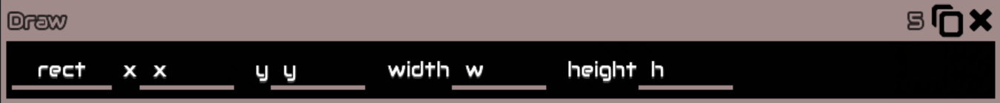

    ```mlog
    draw rect x y w h 0 0
    ```

    - `x` : coordonnée x du coin supérieur gauche du rectangle.
    - `y` : coordonnée y du coin supérieur gauche du rectangle.
    - `w` : largeur du rectangle.
    - `h` : hauteur du rectangle.
    - `0 0` : paramètres inutilisés.

7. `lineRect` : dessine le contour d'un rectangle.

   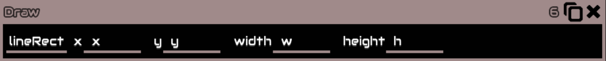

    ```mlog
    draw lineRect x y w h 0 0
    ```

    - `x` : coordonnée x du coin supérieur gauche du rectangle.
    - `y` : coordonnée y du coin supérieur gauche du rectangle.
    - `w` : largeur du rectangle.
    - `h` : hauteur du rectangle.
    - `0 0` : paramètres inutilisés.

8. `poly` : dessine un polygone plein.

   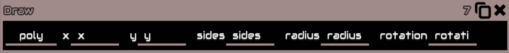

    ```mlog
    draw poly x y sides radius rotation 0
    ```

    - `x` : coordonnée x du centre du polygone.
    - `y` : coordonnée y du centre du polygone.
    - `sides` : nombre de côtés du polygone.
    - `radius` : rayon du polygone.
    - `rotation` : rotation du polygone.
    - `0` : paramètre inutilisé.

9. `linePoly` : dessine le contour d'un polygone.

   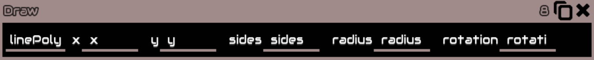

    ```mlog
    draw linePoly x y sides radius rotation 0
    ```

    - `x` : coordonnée x du centre du polygone.
    - `y` : coordonnée y du centre du polygone.
    - `sides` : nombre de côtés du polygone.
    - `radius` : rayon du polygone.
    - `rotation` : rotation du polygone.
    - `0` : paramètre inutilisé.

10. `triangle` : dessine un triangle plein.

    

    ```mlog
    draw triangle x y x2 y2 x3 y3
    ```

    - `x` : coordonnée x du premier point du triangle.
    - `y` : coordonnée y du premier point du triangle.
    - `x2` : coordonnée x du deuxième point du triangle.
    - `y2` : coordonnée y du deuxième point du triangle.
    - `x3` : coordonnée x du troisième point du triangle.
    - `y3` : coordonnée y du troisième point du triangle.
    - **⚠ Attention** : les coordonnées des points doivent être dans l'ordre des aiguilles d'une montre.

11. `image` : affiche une image.

    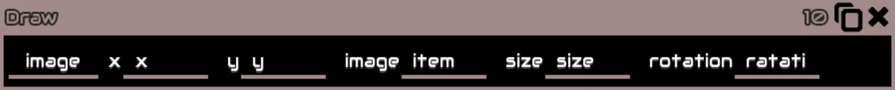

    ```mlog
    draw image x y item size ratation 0
    ```

    - `x` : coordonnée x du coin supérieur gauche de l'image.
    - `y` : coordonnée y du coin supérieur gauche de l'image.
    - `item` : nom de l'item à afficher.
    - `size` : taille de l'image.
    - `rotation` : rotation de l'image.
    - `0` : paramètre inutilisé.
    - **⚠ Attention** : item est soit un Object, soit une unité.

---

## Contrôle de Blocs

---

## Opérations

---

## Contrôle de Flux

---

## Contrôle d'unités

---

[Précédent](variables-et-operateurs.md) | [🏠](../README.md) | [Suivant](ia.md)
