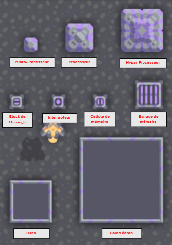

# Les différents composants logiques

Dans cette section, nous allons explorer les composants logiques de base disponibles dans *Mindustry*. Ces composants
sont essentiels pour la création de circuits logiques et de systèmes de contrôle sophistiqués. Nous allons examiner
chaque composant en détail, en expliquant son fonctionnement et en présentant des exemples d'utilisation.

---

Tableau des Différents Processeurs :

| Composant        | Description                                                                                                                            | Santé | Taille (block × block) | Durée de construction (sec) | Vitesse (lig/sec) | Portée (blocks) | Matériaux requis                                                                |
|------------------|----------------------------------------------------------------------------------------------------------------------------------------|-------|------------------------|-----------------------------|-------------------|-----------------|---------------------------------------------------------------------------------|
| Micro-Processeur | Un composant de base qui exécute des instructions logiques.                                                                            | 40    | 1 × 1                  | 2                           | 120               | 10              | 90 de `Cuivre`, 50 de `Plomb`, 50 de `Silicium`                                 |
| Processeur       | Un composant plus avancé que le micro-processeur, capable d'exécuter des instructions plus rapidement. et sur une plus grande échelle. | 190   | 2 × 2                  | 6,71                        | 480               | 22              | 320 de `Plomb`, 60 de `Graphite`, 50 de `Tornium`, 50 de `Silicium`             |
| Hyper-Processeur | Un composant haut de gamme, capable d'exécuter des instructions très rapidement et sur une très grande échelle.                        | 520   | 3 × 3                  | 9,62                        | 1500              | 42              | 450 de `Plomb`, 75 de `Tornium`, 150 de `Silicium`, 50 de `Alliage Superchargé` |

L'Hyper-Processeur produit aussi du `liquide cryogénique` à un taux de 4.8 unités par seconde et peut en stocker 10
unités.

---

Tableau des Différent Blocs de Mémoire :

| Composant         | Description                                                                    | Santé | Taille (block × block) | Durée de construction (sec) | Taille de stockage (nb variable) | Matériaux requis                                                        |
|-------------------|--------------------------------------------------------------------------------|-------|------------------------|-----------------------------|----------------------------------|-------------------------------------------------------------------------|
| Cellule mémoire   | Un composant qui stocke des information pour un processeur.                    | 40    | 1 × 1                  | 1,15                        | 64                               | 30 de `Cuivre`, 30 de `Graphite`, 30 de `Silicium`                      |
| Banque de mémoire | Un composant qui stocke une grande quantité d"informations pour un processeur. | 200   | 2 × 2                  | 3,3                         | 512                              | 30 de `Cuivre`, 80 de `Graphite`, 80 de `Silicium`, 30 de `Tissu Phasé` |

---

Tableau des Différents Composants de Intéractifs :

| Composant        | Description                                                  | Santé | Taille (block × block) | Durée de construction (sec) | Matériaux requis               |
|------------------|--------------------------------------------------------------|-------|------------------------|-----------------------------|--------------------------------|
| Block de message | Un composant qui stocke un message texte.                    | 40    | 1 × 1                  | 0,12                        | 5 de `Cuivre`, 5 de `Graphite` |
| Interrupteur     | Un composant qui peut être activé ou désactivé manuellement. | 40    | 1 × 1                  | 0,12                        | 5 de `Cuivre`, 5 de `Graphite` |

---

Tableau des Différents écrans :

| Composant   | Description                                                  | Santé | Taille (block × block) | Durée de construction (sec) | Résolution (px × px) | Matériaux requis                                                                |
|-------------|--------------------------------------------------------------|-------|------------------------|-----------------------------|----------------------|---------------------------------------------------------------------------------|
| Écran       | Affiche des images à partir des instruction d'un processeur. | 360   | 3 × 3                  | 3,08                        | 80 × 80              | 100 de `Plomb`, 50 de `Verre trempé` , 50 de `Silicium`                         |
| Grand écran | Affiche des images à partir des instruction d'un processeur. | 1800  | 6 × 6                  | 8,45                        | 176 × 176            | 200 de `Plomb`, 100 de `Verre trempé` , 150 de `Silicium` , 75 de `Tissu Phasé` |

---

