# Les Différents Variables et Opérateurs en `mlog`

Dans cette section, nous allons explorer les différents globales variables et d'opérateurs disponibles dans le langage
`mlog`. Ces éléments sont essentiels pour la création de circuits logiques et de systèmes de contrôle sophistiqués. Nous
allons aussi définir les diférents types de variable disponible dans le langage `mlog`

---

## Type de Variables

Les variables sont des éléments qui peuvent stocker des valeurs numériques, des chaînes de caractères, des booléens et
d'autres types de données. Les variables sont utilisées pour stocker des informations importantes, telles que des
paramètres de configuration ou des états de système. Voici les différents types de variables disponibles dans le
langage `mlog` :

| Type de Variable     | Type          | Image                                          | Description                                                                                                                                                                                     |
|----------------------|---------------|------------------------------------------------|-------------------------------------------------------------------------------------------------------------------------------------------------------------------------------------------------|
| Numérique            | `number`      |      | Les variables numériques stockent des valeurs numériques, telles que des entiers ou des nombres à virgule flottante.                                                                            |
| Booléen              | `number[0,1]` |      | Les variables booléennes stockent des valeurs booléennes, telles que `true` ou `false`. Même si il sont transformer en number lors du stockage dans une variable (0 pour false et 1 pour true). |
| Chaîne de Caractères | `string`      |      | Les variables de chaîne de caractères stockent des séquences de caractères, telles que des mots ou des phrases.                                                                                 |
| Objet                | `content`     |    | Les variables de type objet stockent des valeurs d'entité, telles que des matériaux ou des ressources.                                                                                          |
| Batiments            | `building`    |  | Les variables de type building stockent des valeurs de bâtiments.                                                                                                                               |
| Unitées              | `unit`        |          | Les variables de type unit stockent des valeurs d'entité qui sont des unités.                                                                                                                   |
| Null                 | `null`        |          | Les variables de type null stockent des valeurs nulles.                                                                                                                                         |

---

## Variables Globales

Les variables globales sont des éléments qui peuvent être utilisés dans n'importe quelle partie de votre code. Elles
peuvent stocker des valeurs numériques, des chaînes de caractères, des booléens et d'autres types de données. Les
variables globales sont utiles pour stocker des informations importantes, telles que des paramètres de configuration ou
des états de système.

### Variable Générale

Les variables générales sont des variables qui peuvent être utilisées dans n'importe quelle partie de votre code et
disponible pour tous les processeurs.

| Nom  | 	Nom IG | Description                                                                 | Type    | Valeur par défaut (si existant) |
|------|---------|-----------------------------------------------------------------------------|---------|---------------------------------|
| unit | @unit   | La variable unit est une variable les unités selectionné par le processeur. | content | null                            |

### Variable de Matériaux

Les variables de matériaux sont des variables qui peuvent être utilisées dans n'importe quelle partie de votre code et
disponible pour tous les processeurs. Ils sont tous de type `content`.

| Nom                 | Nom IG          | Image                                                            |
|---------------------|-----------------|------------------------------------------------------------------|
| cuivre              | 	@copper        | 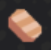                   |
| plomb               | 	@lead          |                       |
| Verre Trempé	       | @metaglass      |           |
| graphite            | 	@graphite      |                |
| sable               | 	@sand          | 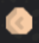                      |
| Charbon	            | @coal           |                     |
| titane	             | @titanium       | 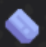                 |
| thorium	            | @thorium        | 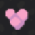                 |
| féraille            | 	@scrap         |                   |
| silicium            | 	@silicon       |                 |
| plastanium          | 	@plastanium    |            |
| tissu phasé         | 	@phase-fabric  | 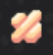        |
| alliage superchargé | 	@surge-alloy   |  |
| spore	              | @spore-pod      | 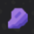                 |
| mélange explosif	   | @blast-compound |  |
| pyratite	           | @pyratite       |                |

### Variable de Liquides

Les variables de liquides sont des variables qui peuvent être utilisées dans n'importe quelle partie de votre code et
disponible pour tous les processeurs. Ils sont tous de type `content`.

| Nom       | Nom IG     | Image                                               |
|-----------|------------|-----------------------------------------------------|
| eau       | @water     |            |
| scorie    | @slag      | 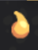         |
| pétrole   | @oil       |          |
| cryofluid | @cryofluid | 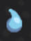 |
| néoplasme | @neoplasm  |   |
| arkydite  | @arkycite  |    |
| ozone     | @ozone     |          |
| hydrogène | @hydrogen  |   |
| azote     | @nitrogen  |       |
| cyanogène | @cyanogen  |   |

### Variable d'unités

Les variables d'unités sont des variables qui peuvent être utilisées dans n'importe quelle partie de votre code et
disponible pour tous les processeurs. Ils sont tous de type `content`.

| Nom | Nom IG | image |
|-----|--------|-------|

### Variable de Bâtiments

Les variables de bâtiments sont des variables qui ne peuvent être utilisées pour les batiments lier au processeur. Ils
sont tous de type `building`. Ces variables sont définis à la liaison du processeur avec un batiment.

---

## Opérateurs

Les opérateurs sont des symboles qui effectuent des opérations sur des variables et des valeurs. Ils sont utilisés pour
effectuer des calculs, des comparaisons et d'autres manipulations de données.

### Opérateurs Arithmétiques

Les opérateurs arithmétiques sont utilisés pour effectuer des opérations mathématiques sur des variables numériques.

| Opérateur | Description                         | Nom       | Image                                                 |
|-----------|-------------------------------------|-----------|-------------------------------------------------------|
| +         | Addition                            | add       |              |
| -         | Soustraction                        | sub       |              |
| *         | Multiplication                      | mul       |              |
| /         | Division                            | div       |              |
| //        | Division entière                    | idiv      |            |
| %         | Modulo                              | mod       | 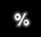             |
| **        | Puissance                           | pow       |              |
| <<        | Décalage binaire à gauche           | shl       |              |
| \>\>      | Décalage binaire à droite           | shr       |              |
| max       | Maximum de deux valeurs             | max       |              |
| min       | Minimum de deux valeurs             | min       |              |
| angle     | Calcul de l'angle entre deux points | angle     |          |
| angleDiff | Différence entre deux angles        | angleDiff |  |
| len       | Longueur d'un vecteur               | len       |              |
| noise     | Génération de bruit aléatoire       | noise     |          |
| abs       | Valeur absolue                      | abs       |              |
| log       | Logarithme naturel                  | log       |              |
| log10     | Logarithme en base 10               | log10     |          |
| floor     | Arrondi à l'entier inférieur        | floor     |          |
| ceil      | Arrondi à l'entier supérieur        | ceil      |            |
| sqrt      | Racine carrée                       | sqrt      |            |
| rand      | Génération d'un nombre aléatoire    | rand      |            |
| sin       | Sinus                               | sin       |              |
| cos       | Cosinus                             | cos       |              |
| tan       | Tangente                            | tan       |              |
| asin      | Arc sinus                           | asin      |            |
| acos      | Arc cosinus                         | acos      |            |
| atan      | Arc tangente                        | atan      |            |

### Opérateurs de Comparaison

Les opérateurs de comparaison sont utilisés pour comparer des variables et des valeurs.

| Opérateur | Description         | Nom           | Image                                                         |
|-----------|---------------------|---------------|---------------------------------------------------------------|
| ==        | Égal à              | equal         |                  |
| !=        | Différent de        | notEqual      |            |
| &&        | ET logique          | land          |                    |
| <         | Inférieur à         | lessThan      |            |
| <=        | Inférieur ou égal à | lessThanEq    | 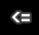       |
| \>        | Supérieur à         | greaterThan   |      |
| \>=       | Supérieur ou égal à | greaterThanEq | 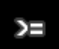 |
| ===       | Strictement égal à  | strictEqual   |      |
| \|\|      | OU logique          | or            |                        |
| &         | ET binaire          | and           |                      |
| ^         | OU exclusif binaire | xor           |                      |
| !         | Négation logique    | not           |                      |

---

[Précédent](composants.md) | [🏠](../README.md) | [Suivant](commandes.md)
